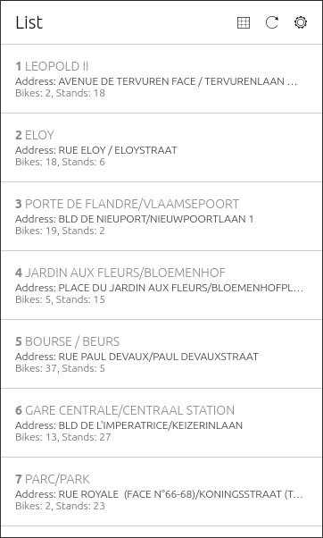
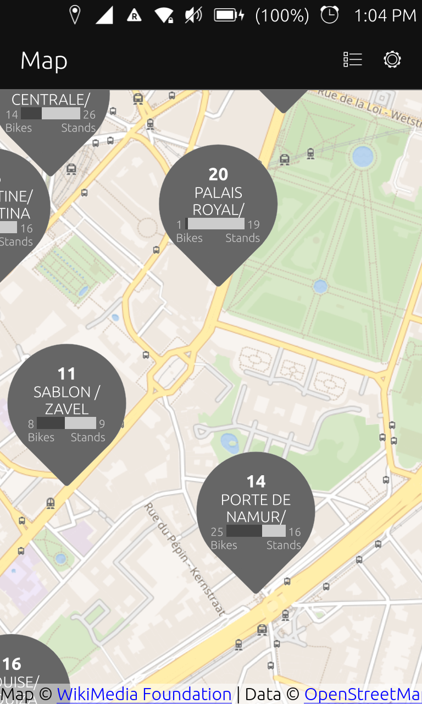

# OpenVelo

This application allows you to display information on bike/station availability of several public bike-sharing schemes on your Ubuntu Touch device. Currently the app delivers information for sharing schemes in Amiens, Besancon, Brisbane, Bruxelles, Cergy-pontoise, Creteil, Dublin, Lillestrom, Ljubljana, Lund, Luxembourg, Lyon, Marseille, Mulhouse, Namur, Nancy, Nantes, Rouen, Santander, Seville, Toulouse, Toyama, Valence, Vilnius.

